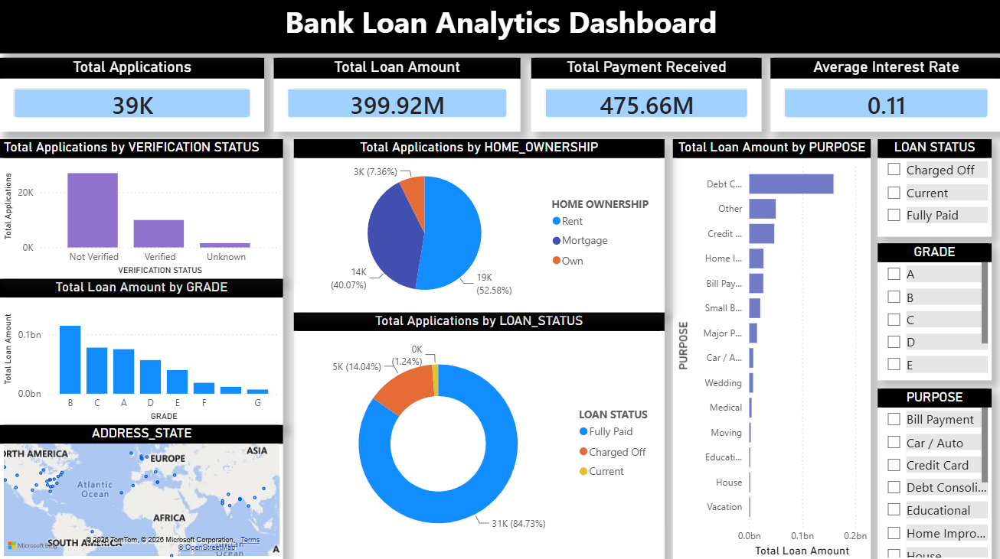

# 📊 Bank Loan Analytics Dashboard
### End-to-End Business Intelligence Solution using Power BI

<p align="center">


</p>

---

# Executive Summary

Financial institutions generate massive volumes of loan application data every day. Transforming this raw information into meaningful business insights is critical for monitoring portfolio performance, identifying lending trends, evaluating customer behaviour, and supporting strategic decision-making.

This project demonstrates an **end-to-end Business Intelligence workflow**, beginning with a cleaned banking loan dataset and culminating in an interactive **Power BI Dashboard** that provides executives with a comprehensive view of lending performance.

The dashboard combines **Power Query**, **DAX**, and **interactive visualizations** to deliver a modern analytics solution for banking and financial services.

---

# Business Problem

Traditional spreadsheet-based reporting makes it difficult to:

- Monitor loan portfolio performance
- Identify lending trends
- Evaluate borrower characteristics
- Compare loan grades
- Analyze geographical lending distribution
- Support executive decision-making

The objective of this project was to transform raw banking data into an interactive dashboard capable of providing real-time business insights.

---

# Dataset Overview

The project uses a cleaned banking loan dataset containing **38,591 loan application records**.

### Dataset includes

- Customer demographics
- Loan amount
- Interest rate
- Loan grade
- Loan purpose
- Home ownership
- Verification status
- Loan status
- Installment amount
- Annual income
- Geographic information
- Repayment information

---

# Business Objectives

The dashboard was designed to answer questions such as:

- What is the total lending volume?
- Which loan grades receive the highest funding?
- Which loan purposes are most common?
- How are borrowers distributed by home ownership?
- What proportion of loans are Fully Paid, Current, and Charged Off?
- Which states contribute the highest loan volumes?
- How does verification status affect loan applications?

---

# Project Workflow

```text
                Raw Loan Dataset
                       │
                       ▼
               Data Cleaning
                       │
                       ▼
             Power Query (ETL)
                       │
                       ▼
               Data Transformation
                       │
                       ▼
               DAX Calculations
                       │
                       ▼
          Interactive Power BI Dashboard
                       │
                       ▼
          Business Insights & Decision Support
```

---

# Data Preparation

Before dashboard development, the dataset was carefully prepared through:

✅ Duplicate Removal

✅ Null Value Handling

✅ Data Type Validation

✅ Text Standardization

✅ Date Format Correction

✅ Numeric Validation

✅ Data Quality Verification

The resulting dataset provided a reliable foundation for business analysis.

---

# Dashboard Overview

The dashboard was designed following Business Intelligence best practices with emphasis on:

- Executive reporting
- Minimal design
- Interactive exploration
- Business storytelling
- KPI-driven analysis

---

# Dashboard Preview





---

# Key Performance Indicators

The dashboard provides executive-level monitoring through:

| KPI | Description |
|------|------------|
| 📄 Total Applications | Overall loan applications received |
| 💰 Total Loan Amount | Total loan portfolio value |
| 💵 Total Payment Received | Total repayments collected |
| 📈 Average Interest Rate | Overall lending interest rate |

---

# Interactive Visualizations

The dashboard contains:

### Portfolio Analysis

- Loan Amount by Grade
- Loan Amount by Purpose

### Customer Analysis

- Home Ownership Distribution
- Verification Status Analysis

### Loan Performance

- Loan Status Distribution

### Geographic Analysis

- Loan Distribution by State

### Interactive Filtering

Users can dynamically analyze the data using slicers for:

- Loan Status
- Grade
- Purpose

---

# Business Insights

The dashboard enables decision-makers to:

✔ Monitor portfolio performance

✔ Understand borrower demographics

✔ Evaluate lending patterns

✔ Analyze customer segments

✔ Monitor repayment status

✔ Identify regional lending trends

✔ Improve strategic lending decisions

---

# Technical Implementation

## Data Source

CSV Dataset

---

## Data Preparation

Power Query

---

## Data Modeling

Power BI

---

## Business Logic

DAX Measures

---

## Visualization

Interactive Dashboard

---

# Technologies Used

| Technology | Purpose |
|------------|---------|
| Power BI Desktop | Dashboard Development |
| Power Query | ETL & Data Cleaning |
| DAX | Business Calculations |
| Excel | Initial Data Preparation |
| CSV | Data Source |

---

# Skills Demonstrated

### Business Intelligence

- Executive Dashboard Design
- KPI Reporting
- Interactive Analytics
- Dashboard Storytelling

---

### Data Analytics

- Data Cleaning
- Data Validation
- Business Analysis
- Data Visualization

---

### Power BI

- Power Query
- DAX Measures
- KPI Cards
- Bar Charts
- Pie Charts
- Donut Charts
- Maps
- Slicers

---

# Business Impact

The dashboard provides a centralized reporting solution that enables stakeholders to quickly evaluate loan portfolio performance and make informed business decisions through interactive analytics.

The solution reduces manual reporting effort while improving visibility into customer behaviour, lending performance, and operational trends.

---

# Repository Structure

```text
Bank-Loan-Analytics-Dashboard
│
├── 📄 README.md
├── 📊 Bank_Loan_Analytics_Dashboard.pbix
├── 📷 Dashboard_Screenshot.png
├── 📁 Book1_cleaned_dataset.csv
└── 📄 LICENSE (optional)
```

---

# Future Enhancements

Potential improvements include:

- Executive multi-page dashboard
- Time-series analysis
- Forecasting models
- Loan default prediction
- Machine Learning integration
- Row-Level Security (RLS)
- Automated refresh
- Drill-through reports
- Mobile dashboard optimization

---

# Key Learning Outcomes

Through this project I gained practical experience in:

- Business Intelligence Reporting
- Dashboard Design
- Data Storytelling
- Power Query
- DAX
- Interactive Analytics
- Executive Reporting
- Financial Data Analysis

---

# About Me

## Akash Ghosh

Aspiring Data Analyst | Business Intelligence Analyst | Data Scientist

**Technical Skills**

- Power BI
- SQL
- Python
- Excel
- Machine Learning
- Data Visualization
- Statistics

---

# Connect With Me

- 💼 LinkedIn: *(Add your LinkedIn profile)*
- 📧 Email: *(Add your email)*

---

# ⭐ If you found this project interesting, please consider giving it a Star!
